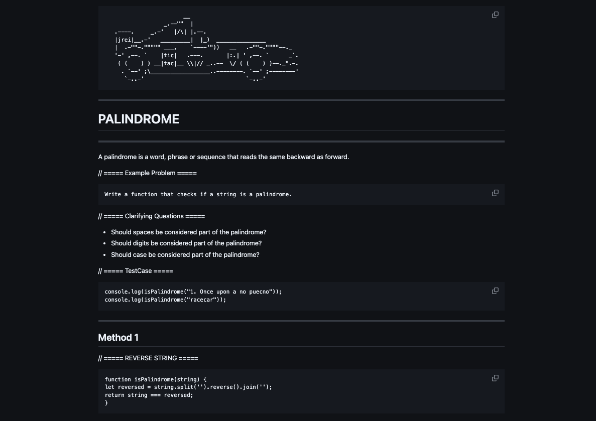

# Algorithm MD

A clinical treatment of ten common algorithms with test cases and eleven common REGEX formats.

ASCII ART to reinforce concepts and make it easier to identify pages at a glance.

## How to Use

1. Open open file for the desired algorithm or test case
2. Review methods for most appropriate to current task
3. Copy and paste code and/or test case to project then edit as needed

## What It Looks Like

## License

Standard MIT license for Open Source